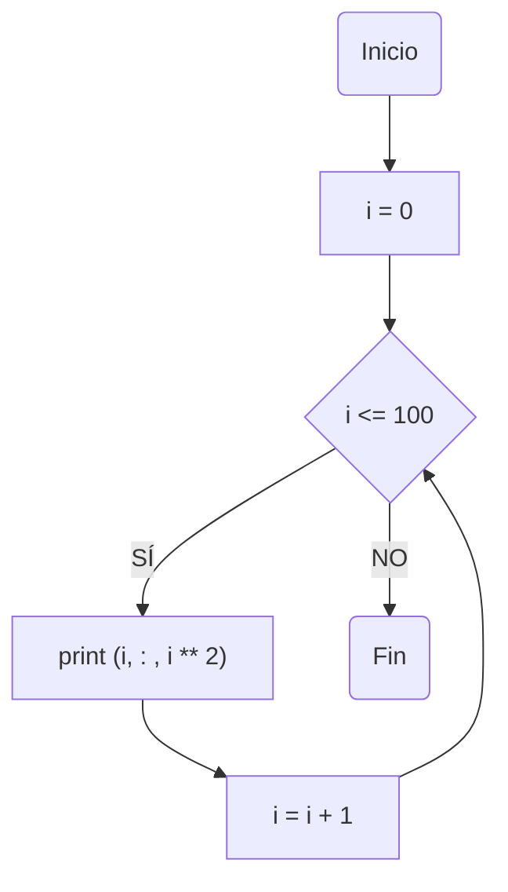
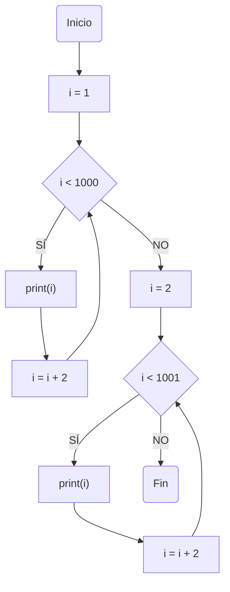
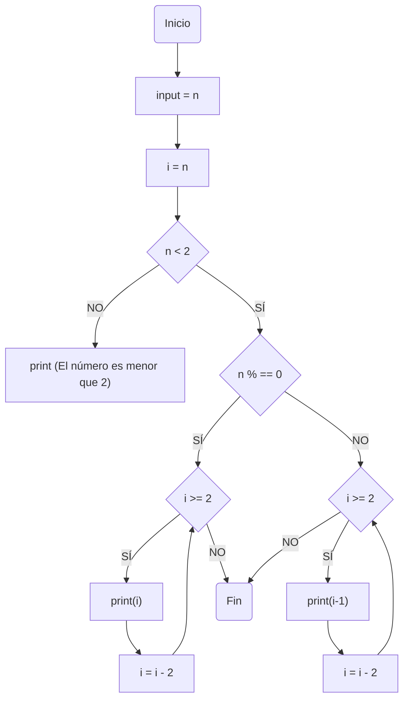

# QuintoDiaPaRoma
Tenemos 6 ejercicios que desarrollar con el bucle de while (adjunto).
## Diagramas de flujo
* 1

```mermaid
flowchart TD
    A(Inicio) -->B[i = 0] 
    B --> C{i <= 100}
    C -->|SÍ|D["print (i, : , i ** 2)" ]
    D -->E[i = i + 1]
    E -->C
    C -->|NO|F
F(Fin)
```
* 2

```mermaid
flowchart TD
    A(Inicio) -->B[i = 1] 
    B --> C{i < 1000}
    C -->|SÍ|D["print(i)"]
    D -->E[i = i + 2]
    E -->C
    C -->|NO|F[i = 2]
    F -->G{i < 1001}
    G -->|SÍ|H["print(i)"]
    H -->I[i = i + 2]
    I -->G
    G -->|NO|J
J(Fin)
```
* 3

```mermaid
flowchart TD
    A(Inicio) -->B[input = n] 
    B --> C[i = n]
    C -->D{n < 2}
    D -->|NO|E["print (El número es menor que 2)"]
    D -->|SÍ|F{n % == 0}
    F -->|SÍ|G{i >= 2}
    G -->|SÍ|H["print(i)"]
    H -->I[i = i - 2]
    I -->G
    F -->|NO|J{i >= 2}
    J -->|SÍ|K["print(i-1)"]
    K -->L[i = i - 2]
    L -->J
    G -->|NO|M
    J -->|NO|M
M(Fin)
```
